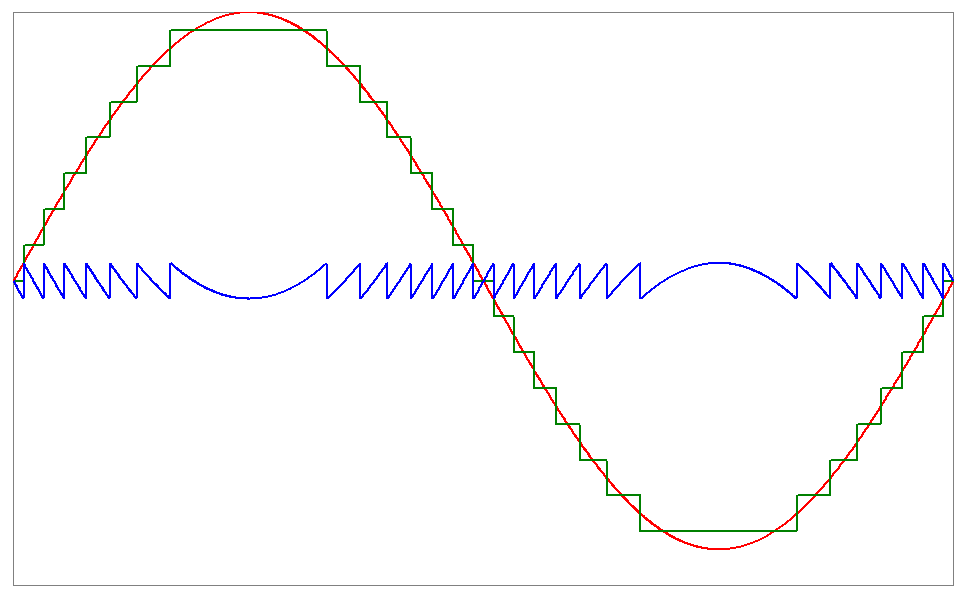

# Introducción al taller de instrumentación

El presente laboratorio pretende introducir al estudiante al modelado y calibración de
señales dinámicas mediante lo siguientes objetivos específicos

- Elaborar un modelo matemático de un canal de comunicación.
- Practicar el uso de herramientas de análisis computacionales.
- Uso de herramientas de control de versiones.

## 1. Metodología
La metodología para el siguiente laboratorio permite definir los pasos necesarios para alcanzar los resultados propuestos.

### 1.1 Diseño del experimento

- La obtención de un modelo de respuesta en frecuencia de un dispositivo bajo prueba. Se utilizará un micrófono de audio y se repetirá tanto con el micrófono de un celular como el de una laptop.

- Se utilizará el modelo de estimación de respuesta en frecuencia por barrido de frecuencia de una señal sinusoidal. La emisión del audio será con un parlante, este reproducirá un audio que hace un barrido de frecuencia desde 50Hz hasta 5kHz.

- Con las grabaciones se hará el análisis de la respuesta en frecuencia de cada micrófono, ambos audios serán almacenados en formatos sin distorsión por compresión.

- Finalmente se elaborará un método para estimar el SNR de las grabaciones con 1kHz de tono como referencia.

### 1.2 Adquisición de datos
- La adquisición de datos será mediante los micrófonos de la laptop y celular, se asegurará una distancia de 1 a 2 metros entre el parlante y el celular/laptop. Cada audio se almacenará y enviará para su análisis.

### 1.3 Procesamiento de datos
- Esta parte implica la sincronización del barrido fuente con el barrido experimental, con el fin de comparar exactamente cada punto en frecuencia del audio y así obtener la función de transferencia del audio obtenido. No se modificará la ecualización ni volumen del audio.
  
### 1.4 Analisis y obtención de función de transferencia
- Mediante algún lenguaje de programación se obtendrá un análisis de ganancia de los datos adquiridos a través del tiempo, de esta forma se obtiene la función de transferencia de la comparación entre la referencia y el audio grabado, con esta información es posible generar un gráfico de respuesta en frecuencia, este permitirá visualmente notar si el micrófono tiene algun filtro en su circuito de procesamiento, mediante atenuaciones o ganancias significativas.
  
### 1.5 Comparación de datos
- Se realizarán comparaciones a partir del audio de referencia con el grabado según el tipo de micrófono, de esta forma se discutirán las diferencias más significativas entre cada función de transferencia, del mismo modo será posible notar el rango de obtención de audio de cada micrófono y los filtros que tengan.
  
### 1.6 Justificación y conclusión de resultados
- Se describirán las herramientas matemáticas y de programación utilizadas para alcanzar los objetivos propuestos y la explicación que permitió obtener la solución para cada función de transferencia. Del mismo modo se expondrán los objetivos alcanzados y los pasos necesarios que permitieron la realización del laboratorio.

## 2. Cuestionario previo

### 2.1 ¿Cómo se mide el signal-to-noise ratio (SNR) para una señalanalógica? Brinde un ejemplo
Es la proporción existente entre la potencia de salida de la señal que se transmite y la potencia del ruido que interfiere con ella, además, se mide en decibeles [0].

Una forma de medirlo es usando un analizador espectral de la señal con la cual se pueda apreciar la forma de la señal y el ruido en el dominio de la frecuencia, se hace una integral de ambas señales y luego se usa la expresión del SNR para obtener el valor final [1]. A continuacion se muestra la expresion para el calculo del signal-to-noise (SNR) [5].

$$SNR = 10\log_{10} \left( \frac{P_{s}}{P_{n}} \right)$$

### 2.2 ¿Cuál es el ancho de banda típico para señales de audio? ¿Una señal de audio tiene componente DC?

De 20Hz a 20Khz ya que según la capacidad auditiva humana solo es posible escuchar sonidos que se encuentran en el rango de frecuencia mencionado anteriormente [2]. 

Toda señal de audio que no haya sido debidamente limpiada de interferencias de bajas o altas frecuencias, tanto en grabación, mezcla o mastering por medio de filtros, son posibles portadoras de desplazamiento de DC [3]. 

### 2.3 ¿Cómo afecta el ruido térmico al SNR de una señal analógica? ¿Cuántos dBm tiene el ruido térmico para una impedancia de 50Ω para una señal cuyo BW= 20kHz?
Es un ruido aleatorio que se genera por la agitación térmica de los portadores. Su espectro de frecuencias es plano, es un ruido blanco. Se genera en cualquier elemento que se comporte como una resistencia.

Eso significa que mientras mas alta sea la temperatura, los portadores de carga tendrán una mayor energía (mas ruido), por lo tanto, al captar un sonido mediante un micrófono que se comporta como una resistencia, este aunque su temperatura no sea alta, de igual forma posee portadores de electrones que producen ruido [4].

El ruido termico para una impedancia de 50Ω para una señal a 20kHz a temperatura ambiente es de -130,82 dBm [5].

### 2.4 ¿Qué es ruido de cuantización? ¿Bajo qué circunstancias se podría modelar como ruido activo?
El error de cuantización es la técnica de representar una señal analógica con un número digital, en general es la conversión analógica a digital de una señal en específico [9].

Imagen recuperada de [12]

### 2.5 ¿Para una grabación de audio, el piso de ruido de la señal es predominado por el ruido de cuantización o el ruido térmico?
Es determinado por el ruido térmico. El ruido térmico o de Johnson es el ruido resultante del movimiento aleatorio de los electrones debido a su agitación térmica. El movimiento da a lugar una corriente aleatoria en consecuencia aparece una tensión de ruido V_r [7].

### 2.6 ¿Cuáles son las tasas de muestreo más populares para grabaciones de auido? ¿La cantidad de bits por muestra?

La frecuencia de muestreo es la cantidad de muestras que se toman por unidad de tiempo para convertir una señal analógica en digital. A nivel general las frecuencias de muestreo utilizadas en los medios digitales han sido 44.1kHz y 48kHz. 
Por la parte de los bits, esta define el rango dinámico del sonido, cuanto mayor es la tasa de bits, se dispone de mayores posicione para ubicar la muestra tomada en la onda. El estándar general es de 44.1kHz a 16bits, para grabaciones de mayor calidad se utiliza una de 32bits. [8]

### 2.7 ¿Cuales son los formatos de audio cuya compresión o almacenamiento no agrega distorsión?

Algunos de los formatos de audio sin pérdida más conocidos son:FLAC (Free Lossless Audio Codec), ALAC (Apple Lossless Audio Codec), WAV (Waveform Audio File Format), APE (Monkey's Audio)[6].

### 2.8 ¿Cómo se puede utilizar un barrido de frecuencias para modelar la respuesta en frecuencia de un dispositivo bajo prueba (DUT)? Investigue el procedimiento a realizar a cada grabación de audio para tener la estimación de la respuesta en frecuencia

Se creará una señal de prueba que contenga un barrido de frecuencia de 50 a 5kHz. Ahora con la utilización de un software de análisis de señales se captura y graba el audio recibido por el dispositivo de prueba. Utilizaremos un analizador de espectro para obtener la respuesta en frecuencia del audio grabado. Por último, se normalizan los datos y se promedian múltiples mediciones para obtener una mayor precisión[2].

## 3. Resultados

Para lograr los resultados deseados, se emplearon un teléfono celular y una tableta en primera instancia. A continuación, se aprovechó el entorno de MATLAB para calcular la Transformada de Fourier de cada grabación de audio. Esta aproximación permitió generar una representación gráfica de cada grabación y, por consiguiente, obtener sus respectivas respuestas en frecuencia.

La formulación para la transformada de Fourier es la siguiente [10]:

$$ X(f)= \int_{- \infty}^{\infty}x(t)e^{-j2\pi ft}dt $$

Para que la Transformada de Fourier sea válida, es necesario que sus coeficientes sean finitos. Esto a su vez implica que la función en cuestión debe ser absolutamente integrable y debe converger. Al utilizar la Transformada de Fourier, se logra una ocupación completa del espectro radioeléctrico, lo que permite abarcar un amplio rango de frecuencias. En el contexto de este laboratorio, se ha aplicado técnicas de programación para aprovechar la Transformada de Fourier y así obtener respuestas en frecuencia detalladas de las señales de audio analizadas.[10].

Con la finalidad de permitir el análisis de la respuesta en frecuencia es posible considerar que los celulares y dispositivos electrónicos basan su ancho de banda en un valor cercano al ancho de banda de la voz humana. Lo cual es correcto, desde hace más de 100 años los teléfonos usan un rango de frecuencia limitada de 300Hz a 3.4kHz, a pesar de eso el espectro de frecuencia de la voz humada se extiende desde 50Hz a 8kHz. En la actualidad ese no es el valor de ancho de banda de los dispositivos actuales, a partir de la introducción de telefonía de voz sobre IP y la capacidad en alta transmisión de las redes es posible permitir un mayor espectro de frecuencia, por lo que el ancho de banda de los dispositivos aumentó de 50Hz 7kHz, esto implica una mayor apreciación de la voz en su ancho de banda [11].

### 3.1 Transformada de Fourier del audio original
 

### 3.2 Transformada de Fourier del audio grabado con celular

 

En la representación gráfica de la Transformada de Fourier del audio capturado mediante el teléfono celular, se evidencia un incremento en la amplitud alrededor de los 100 Hz, seguido de una disminución en un intervalo cercano a los 6 kHz. Esta característica concuerda con el ancho de banda mencionado previamente, que fue seleccionado para resaltar el procesamiento de audio dentro del rango dinámico de las voces humanas. Despues de esa frecuencia, se observa una gradual disminución de la amplitud hasta alcanzar un valor nulo al final del rango de frecuencias.

### 3.3 Transformada de Fourier del audio grabado con laptop
 

La representación gráfica del audio grabado con laptop contempla un comportamiento similar al observado en la grabación con celular. A diferencia del celular, la laptop presenta amplitud desde frecuencia cero, esto demuestra que captó señales fuera del rango de lo que se considera la voz humana. Esta figura presenta un pico de amplitud cecano a los 4.5kHz y a partir de los 5kHz cae en amplitud hasta ser prácticamente nula. Posteriormente a partir de los 40kHz se observa nuevamente amplitud, finalizando el barrido de frecuencia.

### 3.4 Calculo del SNR de la grabacion en el telefono y la computadora

Grabación con el teléfono (SNR = 52,22 dB): En esta grabación, la potencia de la señal deseada (la voz, la música, etc.) es aproximadamente 166724 veces mayor que la potencia del ruido no deseado. Una SNR de 52,22 dB es un valor relativamente alto, lo que sugiere que la señal deseada es clara.

Grabación con la computadora (SNR = 44,97 dB): En esta grabación, la potencia de la señal deseada es aproximadamente 31405 veces mayor que la potencia del ruido. Aunque la SNR es menor que en la grabación del teléfono, sigue siendo un valor respetable. Esto implica que la señal deseada es más fuerte que el ruido, lo que probablemente significa que la calidad de la grabación sigue siendo buena, aunque posiblemente no tan clara como en la grabación del teléfono.

En resumen, ambas grabaciones tienen valores de SNR que indican una buena calidad de señal. Sin embargo, la grabación del teléfono tiene una relación señal-ruido un poco más alta, lo que sugiere que la señal deseada está aún más dominante en esa grabación en particular.

## 4. Referencias
[0] R. Alonso. "Relación señal-ruido o SNR en audio: ¿qué es y por qué importa?" HardZone. https://hardzone.es/reportajes/que-es/relacion-senal-ruido-snr-audio/ (accedido el 6 de agosto de 2023). 

[1] Universitat Politècnica de València - UPV. (2022, 4 de abril). Cálculo de la relación señal a interferencia más ruido (SINR) | | UPV [Video]. YouTube. https://www.youtube.com/watch?v=oLeWP9fIoZ8

[2] R. Sousa. "La señal de audio, conceptos y medidas – TM Broadcast". TM Broadcast – Ingeniería y Tecnología broadcast audiovisual. https://tmbroadcast.es/index.php/la-senal-de-audio-conceptos-y-medidas/ (accedido el 6 de agosto de 2023). 

[3] "DC Offset, Lo Que Siempre Quisiste Saber Y Nadie Te Supo Explicar - Sound:check Magazine". Soundcheck Magazine. https://soundcheck.com.mx/dc-offset-lo-que-siempre-quisiste-saber-y-nadie-te-supo-explicar/ (accedido el 6 de agosto de 2023). 

[4] "RUIDO EN AMPLIFICADORES - PCPfiles en www.pcpaudio.com". PCP audio. https://www.pcpaudio.com/pcpfiles/doc_amplificadores/Bajoruido/Bajoruido.php (accedido el 6 de agosto de 2023). 

[5] M. J. M. Pelgrom, "Analog-to-digital-conversion," 2nd ed. Springer, 2013.

[6] Formatos de audio: Todo lo que Los Músicos deberían Saber para Elegir El Archivo Adecuado (2023b) LANDR Blog. Disponible en: https://blog.landr.com/es/guia-formatos-de-audio/ (Accedido: 06 August 2023). 

[7] UIB. “Ruido”. [En línea]. Disponible en http://dfs.uib.es/GTE/education/telematica/sis_ele_comunicacio/Apuntes/Capitulo%203.pdf

[8] Multisononline J. "Frecuencia de muestreo: Qué es y cómo calcularla".  [En línea]. Disponible en: https://multisononline.com/blog/de-analogico-a-digital-frecuencia-de-muestreo-y-tasa-de-bits-n267. Acceso: 6 de agosto de 2023.

[9] M. J. M. Pelgrom, Analog-to-Digital Conversion, 2nd ed. Dordrecht, Netherlands: Springer Science+Business Media, 2013.

[10] Martínez, M. ¿Qué es la transformada de fourier y para qué sirve?. Nobbot. [En línea] Disponible en: https://www.nobbot.com/que-es-la-transformada-de-fourier-y-para-que-sirve/. Acceso 14 de Agosto de 2023.

[11] NFON.  Audio de banda ancha. NFON. [En línea]. Disponible en: https://www.nfon.com/es/get-started/cloud-telephony/lexicon/base-de-conocimiento-destacar/audio-de-banda-ancha . Acceso 14 de Agosto de 2023.

[12] Colaboradores de los proyectos Wikimedia. (2005, 13 de noviembre). Ruido de cuantificación - Wikipedia, la enciclopedia libre. Wikipedia, la enciclopedia libre. https://es.wikipedia.org/wiki/Ruido_de_cuantificación 
